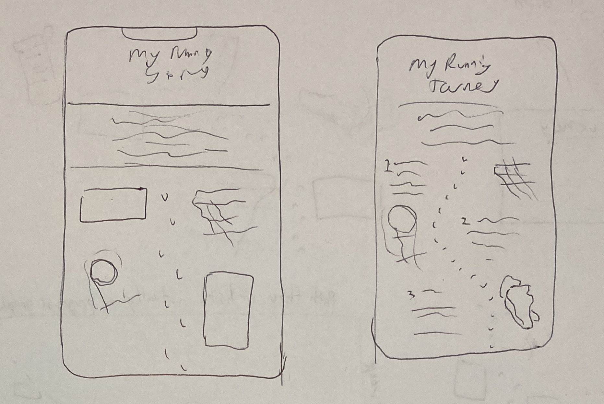
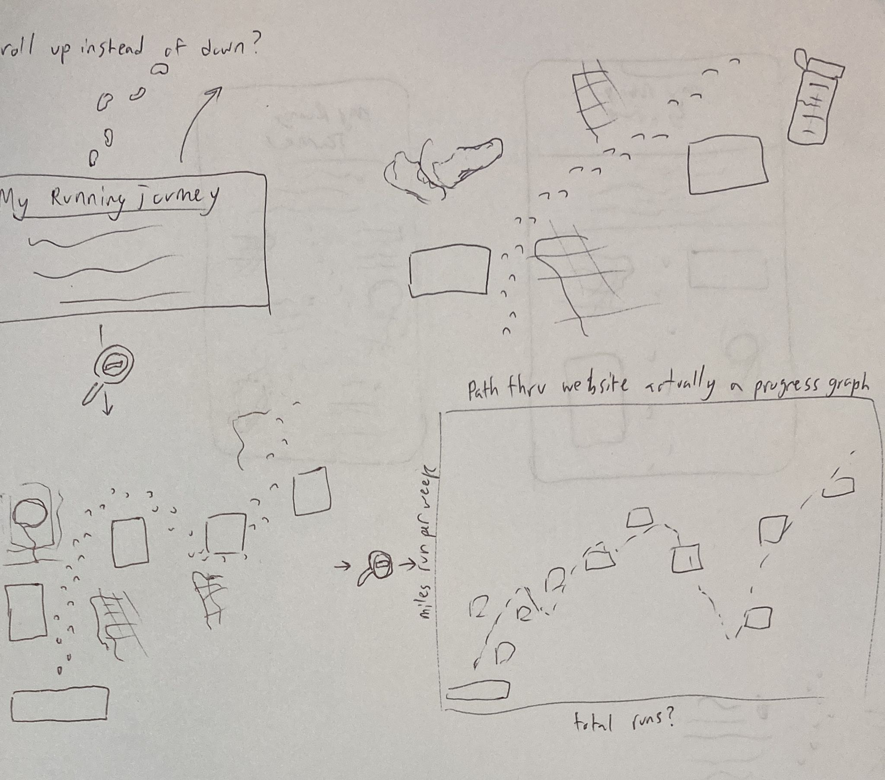
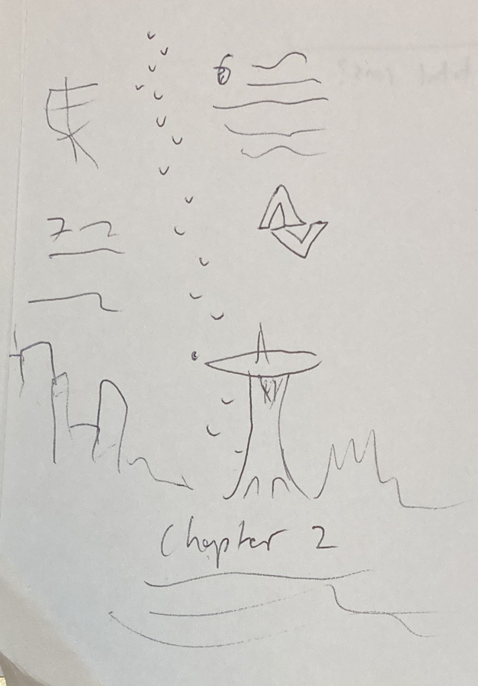

# Project Proposal

## Title: My Running Journey

[Wireframe](https://ian41284128.github.io/WebDevHW/Week_5/)

### Concept:

A blog style website that covers my journey running from it's beginnings last semester through to my present and future goals.

Viewers will be able to see all of my past recorded runs, but the page will be broken into blog-post style "*milestones*" where I record my progress, accomplishments, and things I've learned. Example milestones could be: 
* my first run
* downloading my first run recording app
* getting running shoes
* Running my first 5k
* improving my form/learning to drink water/stretching
* *future plans (Jersey City half marathon, Beijing Marathon)*

### Theme:

A map aesthetic underlying pictures of physical objects and places, like a scrapbook. Lots of pictures of myself and photos I've taken, to make the site my own.

**The look:**

[Moodboard](https://www.pinterest.com/hylianchicken/running-site-mood-board/) 
|
[Nomadic Tribe](https://2019.makemepulse.com/)

A line of footprints running down the center of the page like a dotted line. Milestones appear next to the footpath accompanied by maps showing the routes I took on my runs on the other side (alternating sides with each milestone).

Since I started running, I've run in NYC, Seattle, and hope to run in Shanghai, so I will include full width transitions whenever I travel between places (or plan to).

### How?

*What I can do now:*

* Positioning divs side by side (maps + milestones)

* Including transparent images, overlaying divs and images

* box shadow/css tricks to make elements appear 3D

*What I still need to learn:*

* How to embed map data (can I stylize it in any way?)

* Pattern div fills to fit the map aesthetic

* how to have a path of footprints going down the length of the page

* other cool aesthetic tricks (making the footprints fade in as u scroll???)

* still don't really get how to use flexbox

* and I def need practice designing for iphone