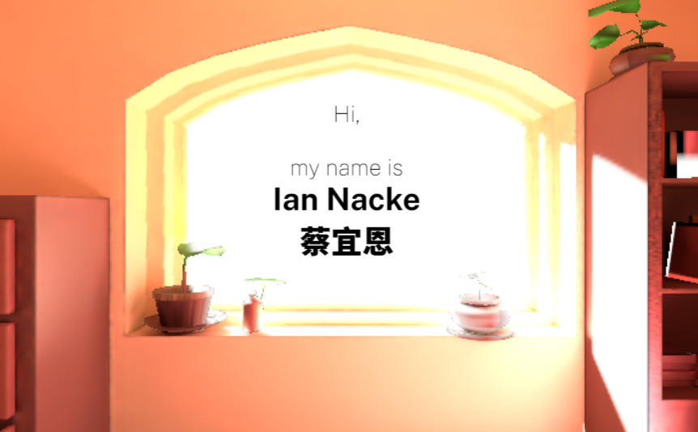
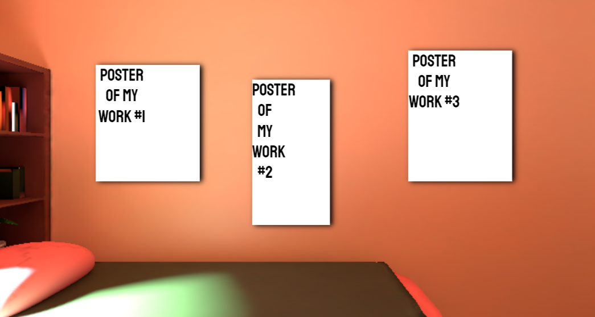
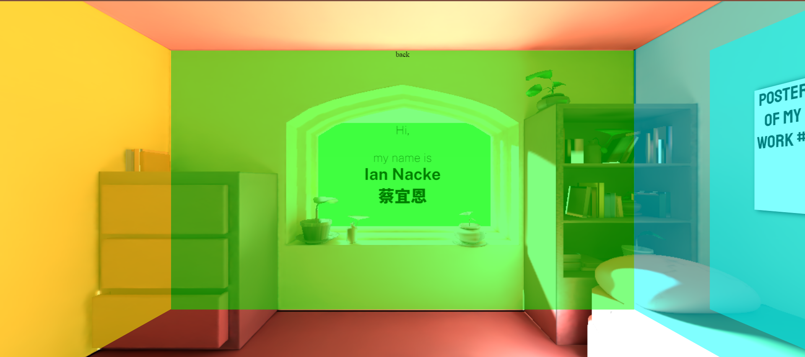
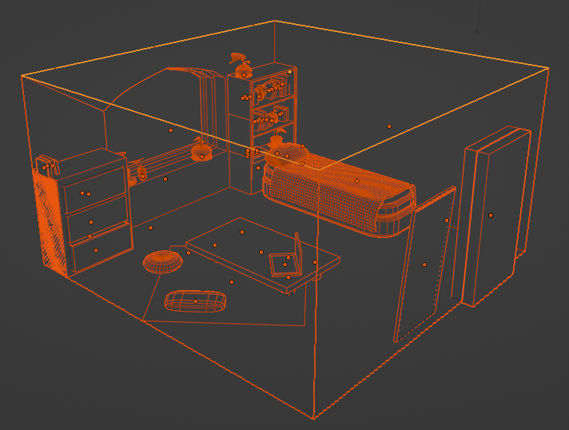
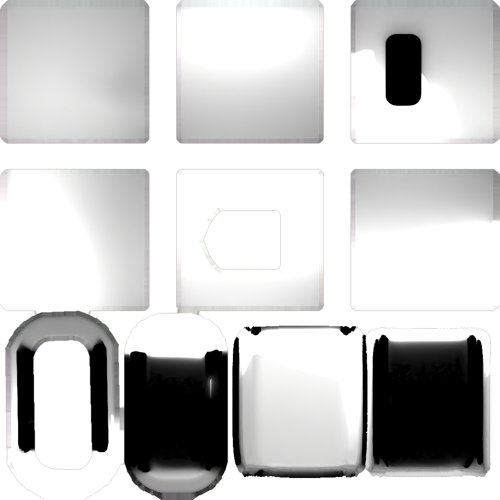
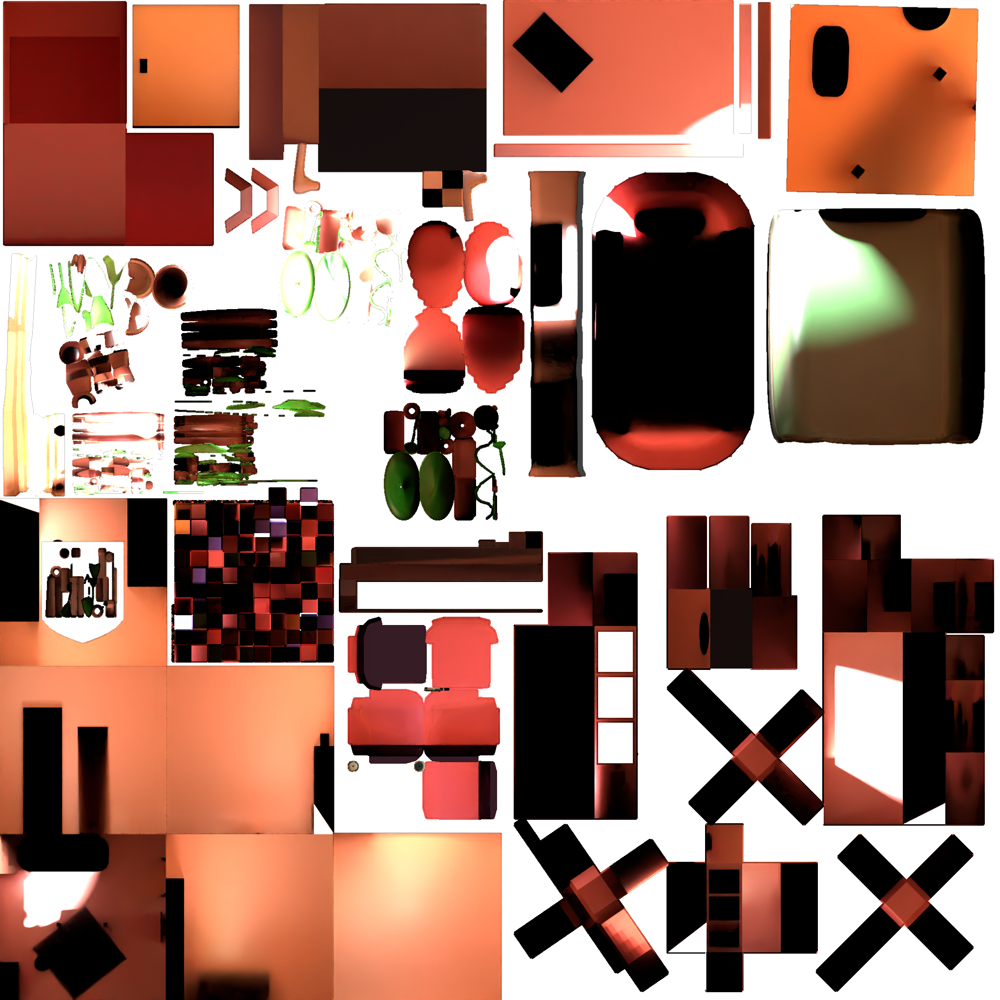

### Ian Nacke
## Web Development Spring 2023 Final Project
# Ian Nacke's Portfolio



## Brief Explanation

A 3D room with portfolio content displayed on the four walls.

Accomplished using THREE.js for rendering, 3D css from scratch, and Blender for model and lightmapping.

---



## Things I learned

### **Three.js**

This aspect of the project was actually the simplest. Using a prebuilt 3D graphics library was straightforward and easy to implement.

### **CSS3D** (Issues I Encountered)



This aspect of the project was the hardest. Especially challenging was recreating the camera projection of my Three.js scene. Guessing and checking was virtually impossible, and in the end I wasn't able to narrow down the perspective and combination of transforms needed to line up my CSS3D cube with the Three.js 3D room.

To accomplish a rough estimation, I used a number of CSS variables, such as calculating the width and height of the walls.

```css
:root {
    --fov: 580px;
    --scale: 2;

    --ww: 177vh;
    --vw-ww: calc((100vw - var(--ww)) / 2);
    --halfw: calc(var(--ww)/2);
    --nhalfw: calc(-1 * (var(--halfw)));

    --wh: calc(var(--ww) * 0.56);
    --vh-wh: calc((100vh - var(--wh)) / 2);
}
```

An additional issue was the matter of rotating the cube a full 360 degrees. I was extremely limited by the functionality of css classes to rotate an object.

Specifically, when the css cube had made a 270 degree rotation, attempting to rotate a full 360 degrees would cause the cube to spin the long way around back to 0 degrees, rather than the short way to 360 degrees. 

```css
.cube.rotate0 {
    transform:  scale3d(var(--scale),var(--scale),var(--scale)) rotateY(0deg) translateX(var(--vw-ww)) translateY(var(--vh-wh));
}
.cube.rotate360 {
    transform:  scale3d(var(--scale),var(--scale),var(--scale)) rotateY(360deg) translateX(var(--vw-ww)) translateY(var(--vh-wh));
}
.cube.rotate90 {
    transform:  scale3d(var(--scale),var(--scale),var(--scale)) rotateY(90deg) translateX(var(--vw-ww)) translateY(var(--vh-wh));
}
...
```

 I don't think there's a way around this issue using purely css classes, though manually setting the style of the objects using javascript might be possible.

---



## Next Steps

### Three.js CSS

In the future, to avoid these and other issues, I want to redesign my site using the CSS3Dobject in the Three.js library. Though it has no documentation and I wanted to limit my use of external libraries, unless I can find a better method of rendering 3D CSS in browser this is my only option. Most websites using Three.js seem to make use of 3D CSS in some way, so I should be able to reference some of them when I do make this change.

---

### Time of Day and Weather Responsive

There were also a number of features that I wanted to implement that I didn't have time for. For example, I wanted the scene to be reactive to the current time of day and weather in the real world. I would accomplish this by rendering more lightmaps of the scene and choosing which one to display based on time and weather information gotten with javascript.

---

### Deployment

Figuring out how to build my project and host it on github.io.

---

### Filling in the rest

Currently my portfolio is still missing the bulk of its content. Adding interactivity, html and css content are all necessary before it is complete.



